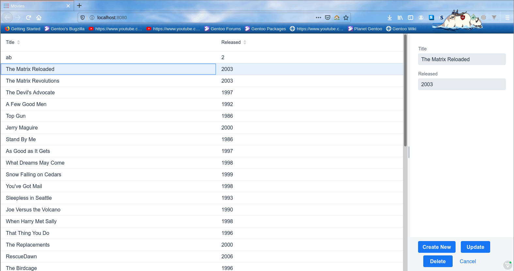

# Demo Neo4j CRUD with Spring Boot and Vaadin

This is to demonstrating how to build website with Spring Boot REST API, Vaadin Fusion Frontend, and Neo4j graph based database.

## REST API Documentation
Please open `Spring-Boot-Neo4j-Demo.postman_collection.json`

